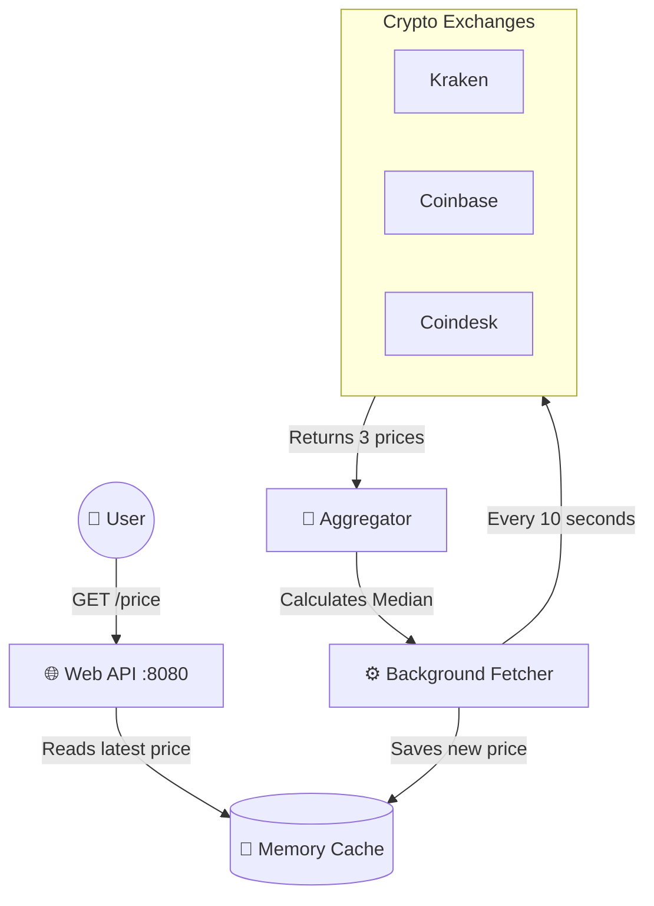

# BTC Price Aggregation Service 

Here is a simple visual map of how the whole system works under the hood for non-technical readers:



## 1. Architecture decisions
When writing this project, I decided to use the classic and clean **Service / Repository architecture**.

- **Controller layer:** This only handles receiving HTTP requests and sending JSON using the Echo framework. There is no other logic here.
- **Service layer (`fetcher`, `aggregator`):** This is the most important part of my system. The Fetcher gets prices from exchanges, and the Aggregator calculates the median.
- **Repository layer:** This is the only place that knows where and how prices are stored. (in my case, in a simple Memory Cache).
- **Provider layer:** I put the connection and talking logic for each exchange (Kraken, Coinbase, Coindesk) in separate files. I connected them with a simple `PriceProvider` interface.

Also, after researching, I decided to use the **Circuit Breaker** pattern (so if an exchange is down, I don't send requests all the time) and an **Exponential Backoff** retry mechanism. For security, I added a simple **Rate Limiter** on Echo to prevent DDoS attacks on my API.

## 2. Tradeoffs made
Because I needed to solve the problem quickly and effectively, I chose simplicity in a few places:
- **In-Memory Cache (instead of Redis):** I keep prices in the program's memory (RAM) because this is still just one server. If I want to scale tomorrow and add many servers, I must switch to a shared Redis database.
- **No complex DTO and Entity models:** Because my program only works with two simple Structs, separating DTO (Data Transfer Object) and Entity models would make my code too complicated. I chose simplicity.
- **Support for only one pair at a time:** Even though my code is ready to support any Currency Pair, right now the background Worker only updates the one pair written in `.env` (like BTC/USD).
- **Strict JSON structure:** I parse the answer from each exchange using a specific Struct made just for it, instead of writing a dynamic JSON map. This is very fast. But if the API changes, I will need to update the struct manually.

## 3. How to run
I made it very simple. You only need to have Docker:
1. Open the terminal and type:
   ```bash
   docker-compose up --build
   ```
2. The server will start on port `8080`.
3. To check it, open your browser or terminal and type:
   - For the price: `curl http://localhost:8080/price` 
   - For a health check: `curl http://localhost:8080/health`
   - For metrics: `curl http://localhost:8080/metrics`       
4. If you want to run it directly with Go: `go run ./cmd/main.go`.

## 4. Testing strategy
When writing tests, I focused only on the "Business Logic":
- **Aggregator tests (Unit):** I tested the math: how it calculates the median for arrays with odd, even, empty, and negative numbers.
- **Retry and Circuit Breaker tests (Unit):** I checked if Exponential Backoff works correctly over time, and if the Circuit Breaker blocks requests after 3 failures and opens again after some seconds.
- **API Mocks:** I don't want my tests to connect to the real internet (like Kraken) and fail if their server is slow. So, I wrote a Mock structure for `HTTPClient` that always returns the data I want during tests.

To run the tests, just type: `go test ./...`

If you want to check the code coverage and see how much code is tested:
```bash
go test -coverprofile=coverage.out ./...
go tool cover -html=coverage.out
```

## 5. What I would like to improve
If we have millions of users, I would add the following:
1. **Move to Redis:** As I mentioned, the In-Memory cache must become Redis quickly, so multiple services can read from the same memory.
2. **WebSocket support:** Now we use HTTP Get. But to see prices in real-time, we need to connect to the exchanges' Websockets to get a continuous stream every second.
3. **Alerting System:** Since I already have Grafana, it would be cool to add notifications to it. For example, if the program crashes or sources get errors all the time, Grafana will automatically send me an Alert to my personal Telegram or Slack.
4. **Problems serving many pairs (Scale):** If the requirements change and I need to serve many pairs at the same time (like 1000 pairs), the code will need big changes:
   - After researching the sources, I found that the Coindesk API does not allow getting many pairs at once or is not flexible enough. I would have to remove Coindesk and find a more professional provider.
   - Instead of parsing JSON for single pairs, I would have to change Structs to accept Batch/Array responses and separate the prices for all pairs.
   - The Cache and Repository will be overloaded from locking and unlocking (Mutex) too often. I would have to add `GetMany` and `SetMany` methods to save hundreds of pairs to memory under a single Lock, which is much more optimal.
   - The cycle in the Background Worker (Fetcher) must change. It shouldn't send requests one by one for every pair. It should group them into one (batch) request, or open a pool of extra asynchronous goroutines (Worker pool).
